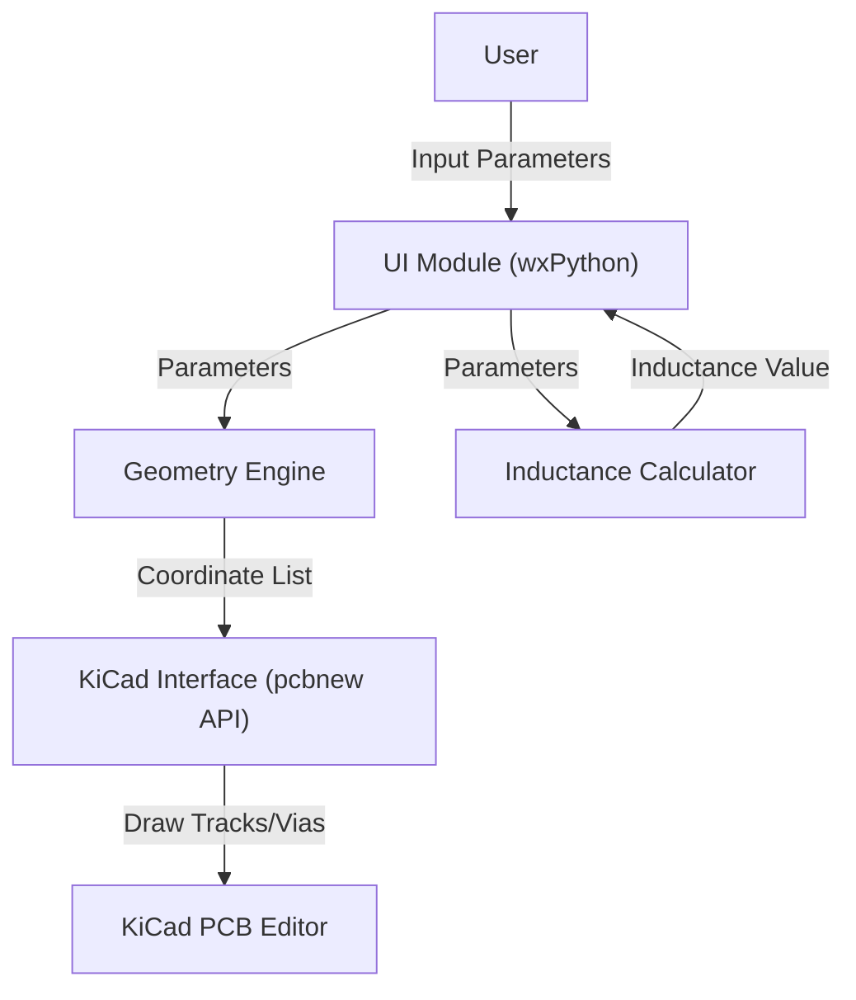

# SpiralGen: Planar Inductor Generator for KiCad
## Design Document

### 1. Introduction
SpiralGen Pro is an advanced Python-based plugin for KiCad 9 designed to automate the creation of simplified planar spiral inductors on PCBs. It supports multiple geometries (Circular, Square, Octagonal) and provides real-time inductance estimation using physics-based models.

### 2. Architecture Overview
The plugin follows a modular architecture, separating the UI, Geometry Engine, Calculation Engine, and PCB Interaction layer.

### 3. Module Breakdown

#### 3.1 User Interface (UI) Module
- **Technology**: `wxPython`.
- **New Features**:
    - Shape Selection (Circular, Square, Octagonal).
    - Via Stitching Checkbox.
    - Live Inductance Estimation.

#### 3.2 Core Logic (Geometry Engine)
- **Function**: Calculates vertices for tracks.
- **Algorithms**:
    - **Circular**: Archimedean Spiral. $r = a + b\theta$.
    - **Square/Octagonal**: Piecewise linear approximation where radius increases discretely at vertices. $d_{r} = \text{pitch} / \text{sides}$.

#### 3.3 Inductance Calculator
- **Function**: Estimates inductance using Modified Wheeler or Mohan’s Data Dependent Expressions.
- **Formula**:
  $$ L = \frac{K_1 \mu_0 n^2 d_{avg}}{1 + K_2 \rho} $$
  Where:
  - $\rho$ (Fill Ratio) = $(d_{out} - d_{in}) / (d_{out} + d_{in})$
  - $d_{avg}$ = Average diameter
  - $K_1, K_2$ = Geometry-dependent coefficients (e.g., Square: $K_1=2.34, K_2=2.75$).

#### 3.4 KiCad Interface
- **Function**: Draws tracks and optional center via.
- **Vias**: Places a through-hole via at (0,0) if requested for layer connectivity.

### 4. Innovation & Exceptionality
- **Multi-Geometry Support**: Demonstrates knowledge of complex geometric algorithms.
- **Physics Integration**: Brings textbook formulas (Mohan's) into a practical EDA tool.
- **Practicality**: Via stitching addresses real-world routing needs.
