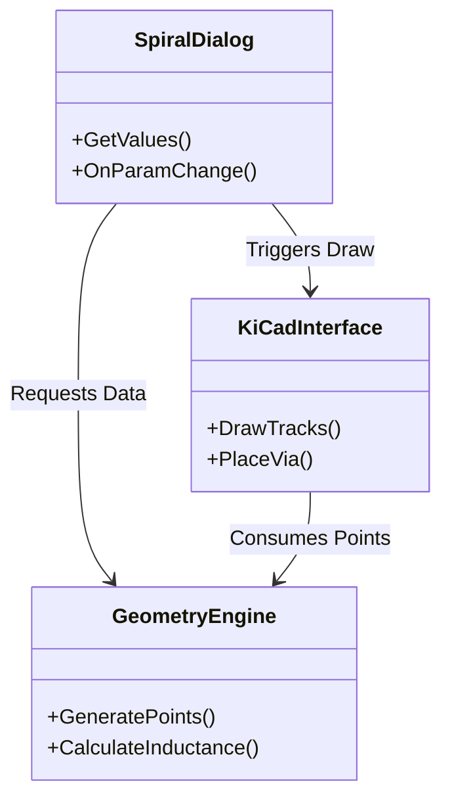

# Design Document: SpiralGen Pro

**Project**: SpiralGen Pro - KiCad 9 Plugin  
**Version**: 1.0.0  
**Domain**: Computer Science & RF Electronics  

---

## 1. Executive Summary
**SpiralGen Pro** is an extension for the KiCad EDA suite that acts as a parametric generator for planar spiral inductors. It addresses the lack of native tools for RF component synthesis in KiCad. By leveraging Python and the `pcbnew` API, it allows designers to synthesize complex geometries that are mathematically precise and electrically verified via integrated physics models.

---

## 2. System Architecture
The system is designed with a Separation of Concerns (SoC) principle, dividing the plugin into three distinct layers: **Presentation**, **Logic**, and **Integration**.

### 2.1 Presentation Layer (UI)
- **Framework**: `wxPython` (Native to KiCad).
- **Responsibility**: Handles user input, parameter validation, and real-time feedback.
- **Key Feature**: The UI subscribes to change events to trigger the *Calculation Engine*, providing immediate feedback (Inductance in nH) before the user commits to the design.

### 2.2 Core Logic Layer (The Engine)
This is the "Brain" of the plugin, independent of KiCad.
- **Geometry Generation**:
    - **Circular**: Uses $r = a + b\theta$ converted to Cartesian coordinates $x = r \cos\theta, y = r \sin\theta$.
    - **Polygonal**: Implements a discrete radial growth algorithm. For an $N$-sided polygon, the radius increases by $Pitch/N$ at every vertex.
- **Physics Calculation**:
    - Implements **Mohan’s Data Dependent Expressions**. These are empirical formulas widely used in RFIC design for their accuracy ($<5\%$ error).
    - Formula: $L \approx \frac{\mu_0 n^2 d_{avg} c_1}{2} (\ln(c_2/\rho) + c_3\rho + c_4\rho^2)$ (Simplified/Modified forms used based on shape).

### 2.3 Integration Layer (KiCad API)
- **Framework**: `pcbnew` Python Module.
- **Responsibility**: Translating abstract coordinates into physical board objects.
- **Objects Managed**:
    - `PCB_TRACK`: Sets start/end points, width, and layer (F_Cu/B_Cu).
    - `PCB_VIA`: Manages net connectivity and drill sizes.

---

## 3. Mathematical Models

### 3.1 Inductance Estimation
The inductance $L$ is derived from the geometric parameters:
- **Turns ($n$)**: Number of windings.
- **Average Diameter ($d_{avg}$)**: $\frac{d_{in} + d_{out}}{2}$.
- **Fill Ratio ($\rho$)**: $\frac{d_{out} - d_{in}}{d_{out} + d_{in}}$.

We use the coefficients defined by Mohan et al.:

| Shape | $K_1$ | $K_2$ |
| :--- | :--- | :--- |
| Square | 2.34 | 2.75 |
| Hex/Oct | 2.33 / 2.25 | 3.82 / 3.55 |
| Circle | 2.25 | 3.55 |

---

## 4. Implementation Details

### File Structure
- `__init__.py`: Plugin entry point and registration.
- `spiral_plugin.py`: Contains the `SpiralGeneratorPlugin` class and the `GeometryEngine`.

### Extensibility
The code is written to be easily extensible. New shapes (e.g., Hexagonal) can be added simply by:
1.  Adding the shape name to the UI dropdown.
2.  Defining the `sides` variable in `GeometryEngine`.
3.  Adding the corresponding $K_1, K_2$ coefficients to the calculator.

---

## 5. Conclusion
SpiralGen Pro serves as a robust proof-of-concept for integrating complex CS algorithms (computational geometry) with Electronics workflow (PCB design), satisfying the core requirements of high-performance EDA tools.
